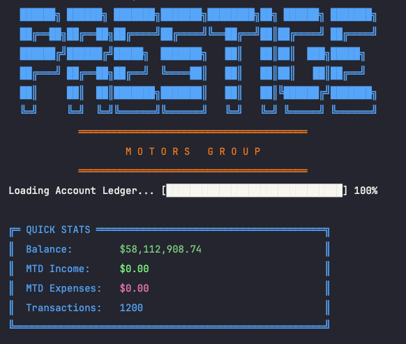
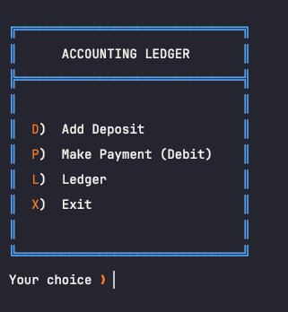
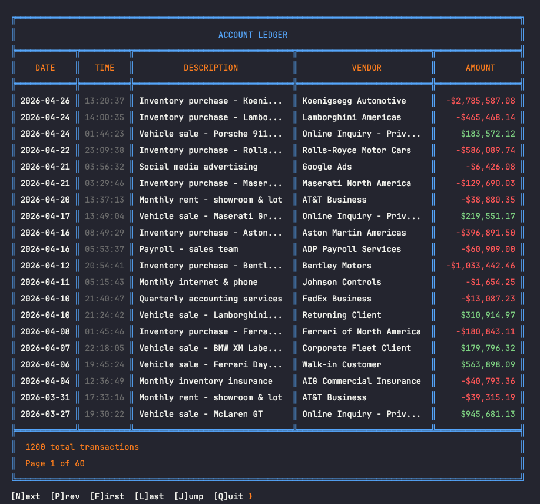
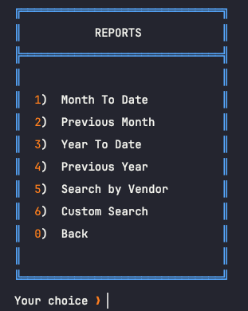
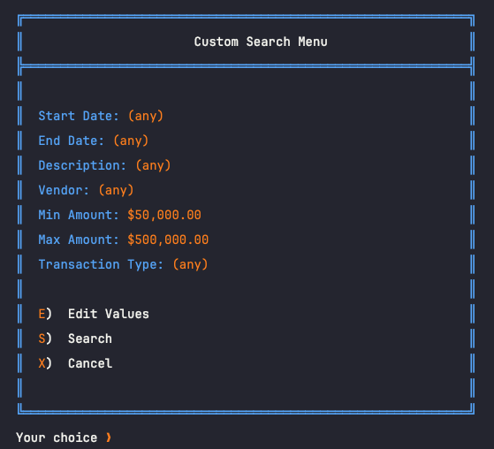
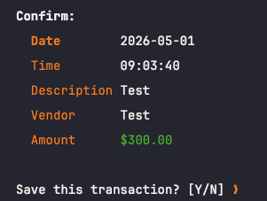

# Account Ledger

A console-based accounting ledger application built in Java. Designed for tracking financial transactions at a luxury automotive dealership — recording deposits and payments, browsing ledger history, and generating date-range and custom reports.

---

## Table of Contents

- [Features](#features)
- [Project Structure](#project-structure)
- [Prerequisites](#prerequisites)
- [How to Run](#how-to-run)
- [Data File Format](#data-file-format)
- [Menu Navigation](#menu-navigation)
- [Screenshots](#screenshots)
- [Known Limitations](#known-limitations)
- [Future Improvements](#future-improvements)

---

## Features

| Feature | Description |
|---|---|
| **Dashboard** | Displays current balance, month-to-date income, month-to-date expenses, and total transaction count on launch |
| **Add Deposit** | Prompts for description, vendor, and amount — auto-stamps the current date and time — and saves to ledger with confirmation |
| **Make Payment** | Same flow as deposit but records a negative (debit) amount |
| **View All Transactions** | Paginated table (20 per page) of all ledger entries, newest first, with deposits in green and payments in red |
| **View Deposits Only** | Filtered view showing only positive transactions |
| **View Payments Only** | Filtered view showing only negative transactions |
| **Month-to-Date Report** | All transactions from the first of the current month through today |
| **Previous Month Report** | All transactions in the previous full calendar month |
| **Year-to-Date Report** | All transactions from January 1st of the current year through today |
| **Previous Year Report** | All transactions in the previous full calendar year |
| **Search by Vendor** | Case-insensitive substring search across vendor names |
| **Custom Search** | Filter by any combination of start date, end date, description, vendor, min/max amount, and transaction type |
| **Persistent Storage** | All transactions are read from and written to `transactions.csv` — data survives between sessions |
| **ANSI Color UI** | Color-coded menus, borders, prompts, and transaction amounts using a consistent design system |

---

## Project Structure

```
account-ledger-capstone/
├── src/
│   └── main/
│       ├── java/com/pluralsight/
│       │   ├── AccountLedgerApp.java          # Entry point
│       │   ├── controller/
│       │   │   └── AppController.java         # App flow and menu routing
│       │   ├── model/
│       │   │   ├── Transaction.java           # Transaction data model
│       │   │   └── SearchCriteria.java        # Custom search filter model
│       │   ├── service/
│       │   │   ├── Ledger.java                # Data access — load, save, filter
│       │   │   └── Reports.java               # Report generation logic
│       │   ├── ui/
│       │   │   └── Menus.java                 # All menu and table rendering
│       │   └── util/
│       │       ├── ConsoleUtilities.java      # ANSI color constants and animations
│       │       └── UserInput.java             # Validated user input prompts
│       └── resources/
│           └── transactions.csv               # Pipe-delimited transaction data
└── pom.xml
```

---

## Prerequisites

- **Java 17** or higher — [Download here](https://adoptium.net/)
- **Apache Maven 3.6+** — [Download here](https://maven.apache.org/download.cgi)
- A terminal that supports **ANSI escape codes** (macOS Terminal, iTerm2, Linux terminals, or Windows Terminal)

Verify your setup:
```bash
java -version
mvn -version
```

---

## How to Run

**1. Clone the repository**
```bash
git clone https://github.com/your-username/account-ledger-capstone.git
cd account-ledger-capstone
```

**2. Compile the project**
```bash
mvn compile
```

**3. Run the application**
```bash
mvn exec:java -Dexec.mainClass="com.pluralsight.AccountLedgerApp"
```

> **Important:** Run from the project root directory (`account-ledger-capstone/`). The app reads and writes `src/main/resources/transactions.csv` relative to your working directory. Running from a different directory will cause a file-not-found error.

---

## Data File Format

Transactions are stored in `src/main/resources/transactions.csv` using pipe (`|`) delimiters. **Do not include a header row.** Each line represents one transaction:

```
DATE|TIME|DESCRIPTION|VENDOR|AMOUNT
```

| Field | Format | Example |
|---|---|---|
| `DATE` | `YYYY-MM-DD` | `2024-03-15` |
| `TIME` | `HH:MM:SS` (24-hour) | `14:22:05` |
| `DESCRIPTION` | Plain text | `Inventory purchase - Ferrari F8` |
| `VENDOR` | Plain text | `Ferrari of North America` |
| `AMOUNT` | Decimal number — **positive = deposit, negative = payment** | `237051.41` or `-82843.70` |

**Example rows:**
```
2024-01-02|09:30:00|Inventory purchase - Ferrari Purosangue|Ferrari of North America|-439912.31
2024-01-04|14:15:22|Vehicle sale - Maserati GranTurismo|Corporate Fleet Client|237051.41
2024-01-08|11:00:00|Sales commission payout|ADP Payroll Services|-49775.24
```

The app ships with **1,200 pre-loaded transactions** spanning 2023–2025 representing a realistic luxury dealership operation.

---

## Menu Navigation

```
Launch → Dashboard → Home Menu
                         │
              ┌──────────┼──────────┐
             [D]        [P]        [L]        [X]
          Add Deposit  Make     Ledger       Exit
                      Payment     │
                               ┌──┴───────────────┐
                              [A]  [D]  [P]  [R]  [H]
                              All  Dep  Pay  Rep  Home
                                        │
                              ┌─────────┴──────────────────┐
                             [1]  [2]  [3]  [4]  [5]  [6]  [0]
                             MTD  Prev  YTD  Prev Vend Cust Back
                                  Mon       Year  or  Search
```

### Home Menu

| Key | Action |
|---|---|
| `D` | Add a new deposit |
| `P` | Record a new payment |
| `L` | Open the Ledger screen |
| `X` | Exit the application |

### Ledger Menu

| Key | Action |
|---|---|
| `A` | View all transactions (paginated) |
| `D` | View deposits only |
| `P` | View payments only |
| `R` | Open the Reports screen |
| `H` | Return to Home |

### Reports Menu

| Key | Action |
|---|---|
| `1` | Month-to-Date — transactions from the 1st of this month through today |
| `2` | Previous Month — full prior calendar month |
| `3` | Year-to-Date — transactions from January 1st of this year through today |
| `4` | Previous Year — full prior calendar year |
| `5` | Search by Vendor — enter a name (partial matches supported) |
| `6` | Custom Search — filter by date range, description, vendor, amount range, and transaction type |
| `0` | Back to Ledger |

### Paginated Transaction Table

| Key | Action |
|---|---|
| `N` | Next page |
| `P` | Previous page |
| `Q` | Quit / return to previous menu |

### Custom Search

When you open Custom Search, your current filter criteria are displayed. From there:

| Key | Action |
|---|---|
| `E` | Edit one of the 7 search fields |
| `S` | Run the search with current criteria |
| `X` | Cancel and return to Reports |

**Editable fields:**

| # | Field | Notes |
|---|---|---|
| 1 | Start Date | Format: `YYYY-MM-DD` |
| 2 | End Date | Format: `YYYY-MM-DD` |
| 3 | Description | Partial match, case-insensitive |
| 4 | Vendor | Partial match, case-insensitive |
| 5 | Min Amount | Minimum absolute transaction value |
| 6 | Max Amount | Maximum absolute transaction value |
| 7 | Transaction Type | `A` = Any, `D` = Deposits only, `P` = Payments only |

---

## Screenshots

### Dashboard (on launch)


### Home Menu


### Transaction Table


### Reports Menu


### Custom Search


### Add Deposit — Confirmation Screen


---

## Known Limitations

- **File path is relative** — the app must be launched from the project root directory or the CSV will not be found
- **No data validation on CSV** — manually edited CSV rows with missing or malformed fields will throw an exception on load
- **No multi-user support** — the CSV is not safe for concurrent access from multiple processes
- **ANSI colors required** — the UI will appear garbled in terminals that do not support ANSI escape codes (e.g., older Windows Command Prompt)
- **Amount of zero** — a transaction with an amount of exactly `$0.00` is neither a deposit nor a payment and will not appear in filtered views

---

## Future Improvements

- [ ] Export any report view to a `.txt` or `.csv` file
- [ ] Edit or void an existing transaction
- [ ] Category tagging (e.g., Inventory, Payroll, Sales, Utilities) with filter support
- [ ] Running balance column in the transaction table
- [ ] ASCII bar chart of monthly income vs. expenses
- [ ] Session summary displayed on exit
- [ ] Configurable CSV path via a properties file
- [ ] Unit tests for `SearchCriteria`, `Ledger` filters, and `UserInput` validators

---

*Built with Java 17 · Maven · No external dependencies*
